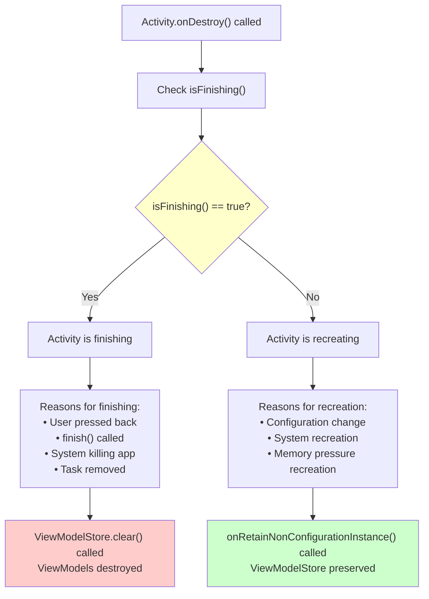

# ViewModel State Retention During Configuration Changes

## Flowchart

```mermaid
flowchart TD
    A["User Action Triggers Configuration Change<br/>e.g., Screen Rotation"] --> B["Android System Detects Change"]
    
    B --> C["Current Activity/Fragment<br/>onPause() called"]
    C --> D["Current Activity/Fragment<br/>onStop() called"]
    D --> E["Current Activity/Fragment<br/>onDestroy() called"]
    
    E --> F{"Is Activity finishing<br/>or just recreating?"}
    
    F -->|"Recreating"| G["onRetainNonConfigurationInstance()<br/>called by system"]
    F -->|"Finishing"| H["ViewModelStore.clear()<br/>IS called"]
    
    G --> G1["System stores ViewModelStore<br/>in NonConfigurationInstances"]
    G1 --> G2["ViewModelStore.clear()<br/>NOT called"]
    
    H --> I["All ViewModels<br/>onCleared() called"]
    I --> J["ViewModels destroyed"]
    
    G2 --> K["ViewModelStore retained<br/>in NonConfigurationInstances"]
    K --> L["New Activity/Fragment<br/>instance created"]
    
    L --> M["New Activity/Fragment<br/>onCreate() called"]
    M --> M1["getLastNonConfigurationInstance()<br/>called in onCreate()"]
    M1 --> M2["ViewModelStore restored<br/>from NonConfigurationInstances"]
    M2 --> N["ViewModelProvider requested<br/>later in lifecycle"]
    
    N --> O["ViewModelProvider checks<br/>already restored ViewModelStore"]
    O --> P{"ViewModel exists<br/>in store?"}
    
    P -->|"Yes"| Q["Return existing<br/>ViewModel instance"]
    P -->|"No"| R["Create new<br/>ViewModel instance"]
    
    Q --> S["Same ViewModel with<br/>preserved state returned"]
    R --> T["Fresh ViewModel<br/>with initial state"]
    
    S --> U["New Activity/Fragment<br/>receives preserved data"]
    T --> U
    
    U --> V["UI restored with<br/>maintained state"]
    
    style A fill:#ffcccc
    style K fill:#ccffcc
    style S fill:#ccffcc
    style V fill:#ccffff
    
    subgraph KeyComponents ["Key Components"]
        W["ViewModelStore<br/>- Holds ViewModel instances<br/>- Survives configuration changes<br/>- Cleared only when Activity finishes"]
        X["ViewModelProvider<br/>- Factory for ViewModels<br/>- Checks existing instances first<br/>- Creates new if needed"]
        Y["ViewModel<br/>- Business logic container<br/>- Survives configuration changes<br/>- onCleared() called when destroyed"]
    end
```



## Detailed Process Explanation

### 1. Configuration Change Detection
- User performs action causing configuration change (rotation, language change, etc.)
- Android system detects the change and decides to recreate the Activity/Fragment

### 2. Current Instance Lifecycle
- Current Activity/Fragment goes through destruction lifecycle:
  - `onPause()` → `onStop()` → `onDestroy()`
- **Critical**: `ViewModelStore.clear()` is NOT called during recreation

### 3. ViewModelStore Preservation
- The `ViewModelStore` containing all ViewModel instances is retained in memory
- This is managed by the `ViewModelStoreOwner` (Activity/Fragment)
- The store survives the configuration change

### 4. New Instance Creation and ViewModelStore Restoration
- New Activity/Fragment instance is created
- `onCreate()` is called first
- **Inside `onCreate()`**: `getLastNonConfigurationInstance()` is called to restore ViewModelStore
- ViewModelStore is restored from NonConfigurationInstances before any ViewModelProvider requests
- Activity continues through lifecycle: `onStart()` → `onResume()`

### 5. ViewModel Retrieval (Later in Lifecycle)
- When `ViewModelProvider.get()` is called later (typically in `onCreate()` after restoration):
  - Provider checks the **already restored** ViewModelStore
  - If ViewModel exists in the restored store, returns the same instance
  - If not found, creates a new instance and adds it to the store

### 6. State Preservation
- The same ViewModel instance with all its data is returned
- UI can be restored with the preserved state
- No data loss occurs during configuration change

## Key Points

- **ViewModelStore**: The container that survives configuration changes
- **ViewModelProvider**: The factory that manages ViewModel lifecycle
- **ViewModel.onCleared()**: Only called when Activity truly finishes, not during recreation
- **onRetainNonConfigurationInstance()**: System method that preserves data during recreation
- **getLastNonConfigurationInstance()**: Retrieves preserved data in new Activity instance
- **NonConfigurationInstances**: Internal Android mechanism for state preservation
- **Automatic Process**: No manual intervention needed from developers

## NonConfigurationInstance Mechanism

### Internal Android Framework Process

1. **onRetainNonConfigurationInstance()**
   - Called automatically by Android system during Activity recreation
   - ComponentActivity overrides this method to return ViewModelStore
   - System stores the returned object in NonConfigurationInstances
   - This happens before the Activity is destroyed

2. **NonConfigurationInstances Storage**
   - Internal Android framework class that holds preserved data
   - Survives the Activity destruction/recreation cycle
   - Contains ViewModelStore and other retained objects
   - Managed entirely by the Android system

3. **getLastNonConfigurationInstance()**
   - Called in new Activity instance during onCreate()
   - Retrieves the previously stored NonConfigurationInstances
   - ComponentActivity uses this to restore ViewModelStore
   - Returns null if Activity is starting fresh (not recreating)

### Code Flow in ComponentActivity

```java
// During Activity destruction (recreation scenario)
@Override
public final Object onRetainNonConfigurationInstance() {
    // System calls this automatically
    ViewModelStore viewModelStore = mViewModelStore;
    if (viewModelStore == null) {
        // No ViewModels to preserve
        return null;
    }
    
    NonConfigurationInstances nci = new NonConfigurationInstances();
    nci.viewModelStore = viewModelStore;
    return nci; // System stores this
}

// During new Activity creation
@Override
protected void onCreate(Bundle savedInstanceState) {
    super.onCreate(savedInstanceState);
    
    NonConfigurationInstances nc = 
        (NonConfigurationInstances) getLastNonConfigurationInstance();
    
    if (nc != null) {
        // Restore preserved ViewModelStore
        mViewModelStore = nc.viewModelStore;
    }
}
```

### Why This Works

- **Automatic Preservation**: System handles the retain/restore cycle
- **Memory Efficiency**: Only ViewModelStore reference is preserved, not entire Activity
- **Lifecycle Aware**: Only works during recreation, not when Activity truly finishes
- **Thread Safe**: Managed by Android framework's main thread

## How Android Determines Activity Recreation vs Finishing

### The `isFinishing()` Method

Android uses the `Activity.isFinishing()` method to determine whether an Activity is being destroyed due to finishing or recreation:

```java
public class ComponentActivity extends Activity implements ViewModelStoreOwner {
    
    @Override
    protected void onDestroy() {
        super.onDestroy();
        
        // This is the key check!
        if (isFinishing()) {
            // Activity is truly finishing - clear ViewModels
            if (mViewModelStore != null) {
                mViewModelStore.clear();
            }
        }
        // If not finishing, ViewModelStore is preserved via onRetainNonConfigurationInstance()
    }
}
```

### Internal Flags and States

The Android framework tracks several internal flags to determine Activity state:

1. **mFinished Flag**
   ```java
   // Inside Activity class
   boolean mFinished = false;
   
   public final void finish() {
       mFinished = true; // Set when finish() is called
       // ... rest of finish logic
   }
   
   public boolean isFinishing() {
       return mFinished;
   }
   ```

2. **Configuration Change Detection**
   ```java
   // Inside ActivityThread (simplified)
   if (configurationChanged && !activity.isFinishing()) {
       // This is a recreation scenario
       // Call onRetainNonConfigurationInstance()
       Object nonConfigInstance = activity.onRetainNonConfigurationInstance();
       // Store for later retrieval
   }
   ```

### Decision Flow in Android Framework



### Specific Scenarios

#### 1. User Navigation (Finishing)
```java
// User presses back button or calls finish()
activity.finish(); // Sets mFinished = true
// Later in onDestroy():
if (isFinishing()) { // Returns true
    viewModelStore.clear(); // ViewModels destroyed
}
```

#### 2. Configuration Change (Recreation)
```java
// Screen rotation detected
// onDestroy() called but finish() was never called
if (isFinishing()) { // Returns false
    // This block is skipped
}
// onRetainNonConfigurationInstance() is called instead
```

#### 3. System-Initiated Recreation
```java
// Low memory or other system reasons
// Activity recreated but not finished
if (isFinishing()) { // Returns false
    // ViewModels preserved
}
```

### Additional Checks in Framework

The Android framework also considers:

1. **Configuration Changes**
   - `android:configChanges` in manifest
   - Runtime configuration change detection

2. **Activity Launch Modes**
   - `singleTop`, `singleTask`, etc.
   - Affects recreation behavior

3. **System State**
   - Available memory
   - Process priority
   - Background/foreground state

### Code Example: Complete Flow

```java
public class ComponentActivity extends Activity {
    private ViewModelStore mViewModelStore;
    
    @Override
    public final Object onRetainNonConfigurationInstance() {
        // Only called during recreation (not finishing)
        ViewModelStore viewModelStore = getViewModelStore();
        if (viewModelStore == null) {
            return null;
        }
        
        NonConfigurationInstances nci = new NonConfigurationInstances();
        nci.viewModelStore = viewModelStore;
        return nci;
    }
    
    @Override
    protected void onDestroy() {
        super.onDestroy();
        
        // The crucial check
        if (isFinishing()) {
            // Activity is truly finishing - clean up ViewModels
            if (mViewModelStore != null) {
                mViewModelStore.clear();
            }
        }
        // If not finishing, ViewModels are preserved via onRetainNonConfigurationInstance()
    }
    
    @Override
    protected void onCreate(Bundle savedInstanceState) {
        super.onCreate(savedInstanceState);
        
        // Restore ViewModelStore if recreating
        NonConfigurationInstances nc = 
            (NonConfigurationInstances) getLastNonConfigurationInstance();
        
        if (nc != null) {
            mViewModelStore = nc.viewModelStore;
        }
    }
}
```

## Benefits

1. **Seamless UX**: Users don't lose their progress during screen rotations
2. **Performance**: No need to reload data from network/database
3. **Simplicity**: Developers don't need complex state saving logic
4. **Reliability**: Built into Android Architecture Components
