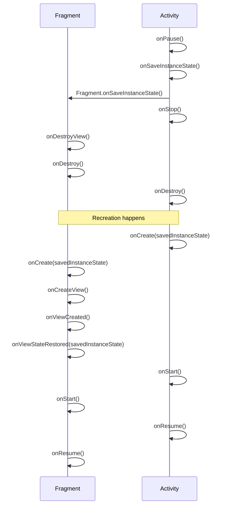
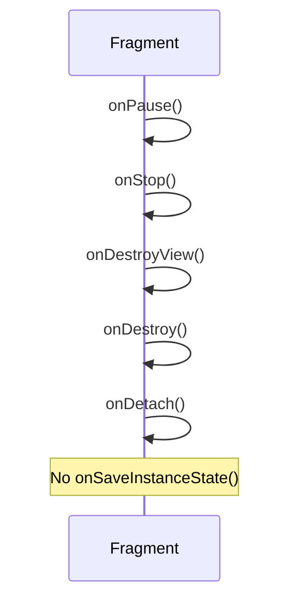
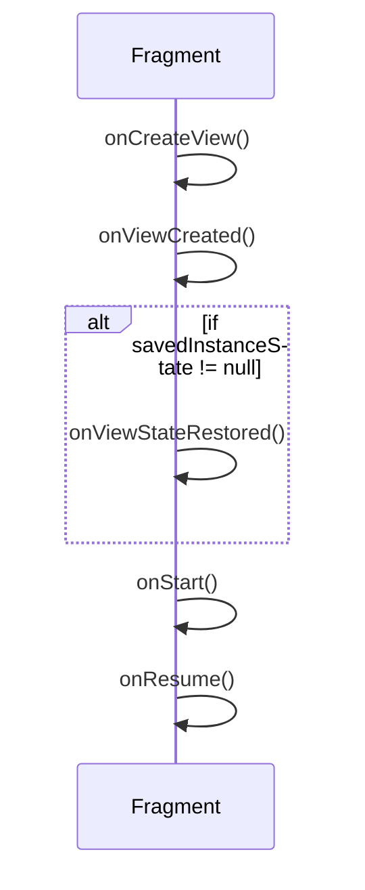

# Fragment Lifecycle, onSaveInstanceState, and onViewStateRestored

## 📌 Key Concepts

### 1. `onSaveInstanceState()`
- Called when Android may recreate the Fragment (e.g., rotation, process death).
- Saves temporary UI-related state into a `Bundle`.
- **Not called** if the Fragment is permanently removed (not coming back).

Example:
```kotlin
override fun onSaveInstanceState(outState: Bundle) {
    super.onSaveInstanceState(outState)
    outState.putString("textKey", editText.text.toString())
}
```

---

### 2. `onViewStateRestored()`
- Called **after** `onViewCreated()` and **before** `onStart()`.
- Only called if there is a `savedInstanceState`.
- Used to restore UI elements.

Example:
```kotlin
override fun onViewStateRestored(savedInstanceState: Bundle?) {
    super.onViewStateRestored(savedInstanceState)
    val restoredText = savedInstanceState?.getString("textKey")
    editText.setText(restoredText)
}
```

---

### 3. Relation with `onDestroy()`
- `onSaveInstanceState()` is **not tied** to `onDestroy()`.
- It’s called **before destruction due to recreation**, but not when fragment is permanently removed.

---

### 4. Activity vs Fragment `onSaveInstanceState()`
- `Activity.onSaveInstanceState()` is called first, then all Fragments’ `onSaveInstanceState()`.
- On recreation:
  - Activity restores in `onCreate()` / `onRestoreInstanceState()`.
  - Fragments restore in `onCreate()` / `onViewStateRestored()`.

---

## 📊 Mermaid Diagrams

### Fragment Lifecycle (Rotation / Recreation)


### Fragment Permanent Removal


### Simplified Order for `onViewStateRestored`

